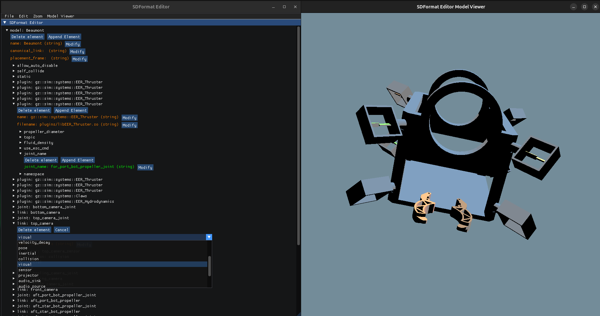

# sdformat-editor

SDFormat Editor is developed by Zaid Duraid, Evan Vokey, and Ean Wheeler for the ECE5100: Software Design Project at Memorial University of Newfoundland.

## Project Description

This project is a stand-alone graphical editor for SDF (Simulation Description Format) files, which are primarily used by the Gazebo robotics simulation tool. The editor allows for editing any .sdf files defined by the [SDFormat 14 Specification](https://github.com/gazebosim/sdformat/tree/sdf14) while also providing a 3D viewer for rendering visual and collision elements.



The project is built in C++ using the CMake build system. It relies on the following dependencies:
- The [libsdformat14 API](https://github.com/gazebosim/sdformat/tree/sdf14) SDF parsing, which is extended upon by the program's SDFormatPraser
- [Dear ImGui](https://github.com/ocornut/imgui) for the user interface
- [OGRE](https://github.com/OGRECave/ogre) for 3D rendering
- [GLM](https://github.com/g-truc/glm) for more complex mathematics operations
- [GoogleTest](https://github.com/google/googletest) for auto-generated testing

## Build Enviroment / OS Support

Development and use of this application is only supported on Ubuntu 24.04 LTS, though it may work in other versions.

To build the project on your own machine, you must first add the OSRFoundation Gazebo Harmonic APT repository to your machine.

```
sudo apt-get update
sudo apt-get install curl lsb-release gnupg

sudo curl https://packages.osrfoundation.org/gazebo.gpg --output /usr/share/keyrings/pkgs-osrf-archive-keyring.gpg
echo "deb [arch=$(dpkg --print-architecture) signed-by=/usr/share/keyrings/pkgs-osrf-archive-keyring.gpg] http://packages.osrfoundation.org/gazebo/ubuntu-stable $(lsb_release -cs) main" | sudo tee /etc/apt/sources.list.d/gazebo-stable.list > /dev/null
sudo apt-get update
```

Next, ensure the following project dependancies are installed:

```
sudo apt-get install build-essential git cmake libglfw3-dev libgl1-mesa-dev libx11-dev zenity libsdformat14-dev
```

Clone the project. Since the project uses git submodules, use the `--recursive`

```
git clone --recursive https://github.com/sdformat-editor/sdformat-editor
```

and build the project with CMake and run:

```
mkdir build
cd build

cmake ..

make

./sdformat-editor
```

Your first build can take a while to complete as most dependancies are built from source. You can speed up the build by using `make -j$(nproc)` instead of `make`.